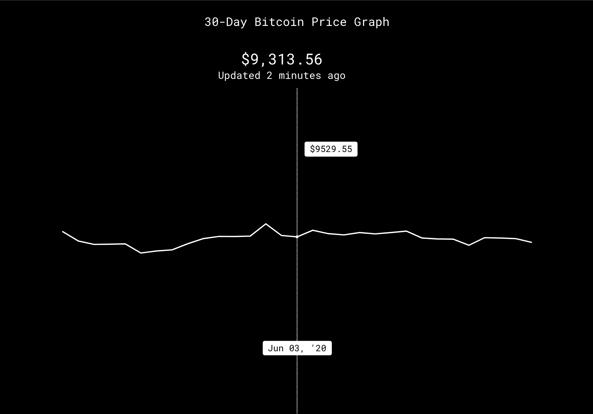

## Table of contents
* [General info](#general-info)
* [Technologies](#technologies)
* [Setup](#setup)

## General info
This is a 30-day bitcoin price graph with real time bit coin price updates every 5 minutes. 

<div align="left">
     
</div>

[Live Demo](https://msynko.github.io/crypto-app/)

## Technologies
Project is created with:
* React 
* VX 
* D3.js 


## Setup
To run this project, install it locally using npm:

```
$ cd ../crypto-app
$ npm install
$ npm start

```
